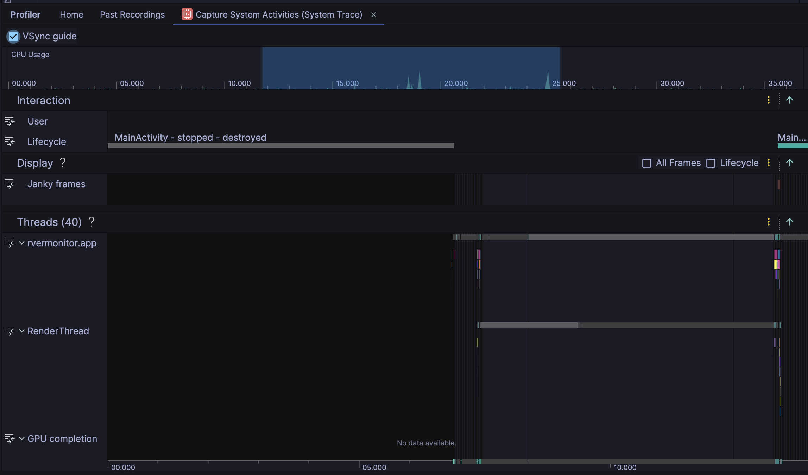
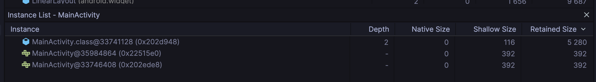

# Усложнение 1 — ДЗ 2

## Запись CPU

## Heap dump: экземпляры MainActivity

## Краткий вывод

После закрытия экрана в heap dump отображаются два объекта `MainActivity`, но у обоих `Depth —`: Profiler не находит путь от GC Root к этим объектам. В сводке Profiler указано `0 Leaks`. Удержания `Activity` достижимыми ссылками не обнаружено; объекты могут быть собраны GC, утечка не выявлена.
