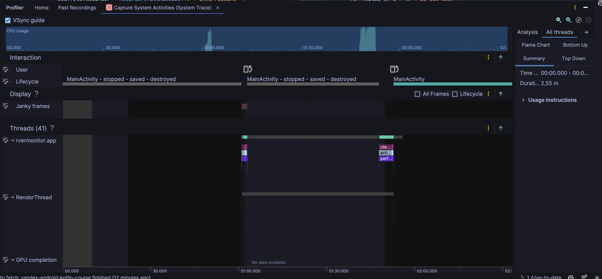
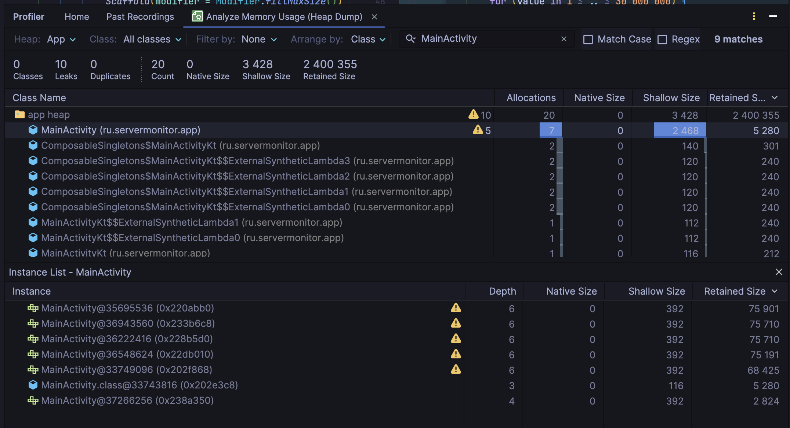

# Усложнение 2 — искусственная деградация приложения

## Искусственная поломка

### CPU: нагрузка на главном потоке

В `MainActivity.onCreate()` добавлена искусственная вычислительная нагрузка. При создании экрана она занимает главный поток, поэтому на записи System Trace видны всплески нагрузки CPU.

### Heap dump: утечка `MainActivity`

Добавлена статическая коллекция, которая сохраняет ссылки на созданные экземпляры `MainActivity`. После пересоздания экрана старые экземпляры остаются достижимыми и не могут быть собраны сборщиком мусора.

На heap dump видно 7 экземпляров `MainActivity`, 5 из них отмечены Profiler как утечки; в сводке указано 10 найденных утечек.

## Результаты до искусственной поломки — усложнение 1

Следующие скриншоты показывают исходное состояние приложения до добавления искусственной нагрузки и утечки.

### Запись CPU

### Heap dump

В исходном heap dump Profiler показывал `0 Leaks`: экземпляры `MainActivity` не удерживались ссылками от GC Root.

## Краткий вывод

Сравнение показывает разницу между исходным состоянием и искусственной поломкой: после добавления вычислений в `onCreate()` на записи CPU появляются пики, а статическая коллекция удерживает экземпляры `MainActivity` после пересоздания экрана. В исходном heap dump утечки не обнаруживались.
